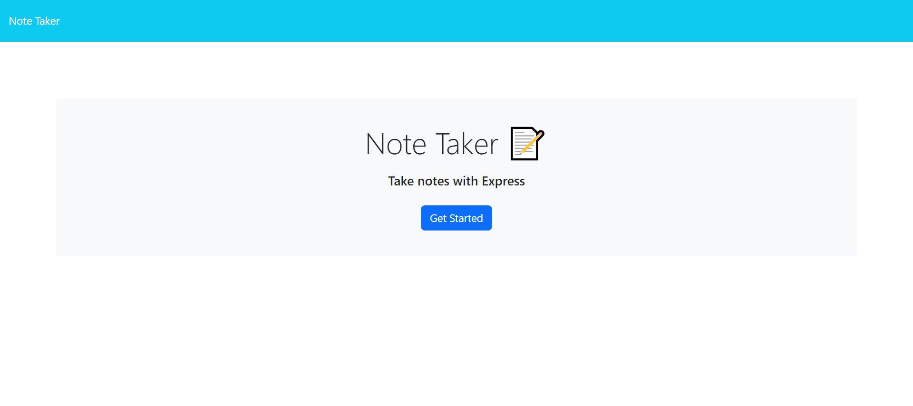
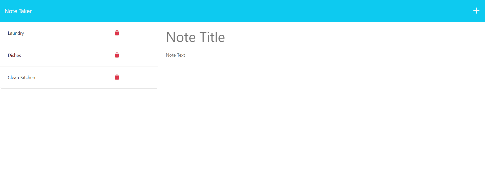

# Note Taker
  

  ## Description

This application is a note taker, available to users to help take notes, create task list, or more. It is built with express.js on the backend to create routes and connect to the front-end for a smooth running application. This website will allow a user to write and save notes to better organize their thoughts and keep track of task that they need to complete.

  ## Usage

To access the deployed website, please visit [Note Taker](https://annie-note-taker-a6a02a32f1fe.herokuapp.com/).

1. To access the note taker portion, once opening the site select "Get Started".
2. From there, please enter a new note or select an existing one on the left hand side.
3. To enter a new note, please type a Note Title and Note Text, once typed in please select the "Save" icon on the top right hand of the site. Once clicked the note will be added to the saved notes on the right hand side.
4. To delete a note, please select the trash icon on the note you wish to delete.

  ## License

This project is licensed under MIT. Please check LICENSE document in repository for more information.

  ## Credit

Frontend of application was starter code provided by University of Texas.

  ## Questions

  If you have any questions, feel free to reach me at [GitHub](https://github.com/Annie-McElroy) or via email at [annie.mcelroy8522@gmail.com](annie.mcelroy8522@gmail.com).